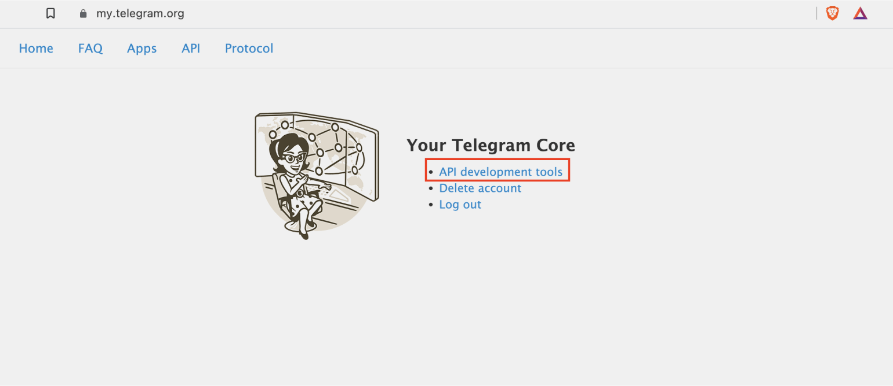
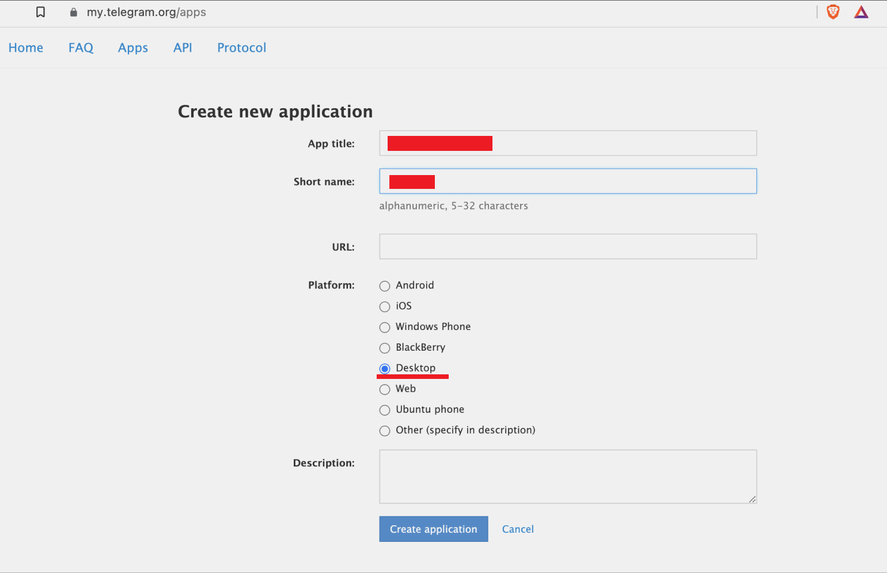

# Telegram Channel Parser

A Python script for analyzing Telegram channels and extracting valuable metrics. This tool is based on and improved from [this article](https://habr.com/ru/articles/891150/).

## Features

For each message in the selected Telegram channel, the parser collects:
- 📅 Date and time of publication
- 📝 Message text
- 🔗 Message link
- 👁️ Views count
- 💬 Comments count
- ↪️ Forwards count
- 📊 Engagement rate

All data is automatically exported to an Excel (.xlsx) file for easy analysis.

## Prerequisites

- Python 3.7 or higher
- Telegram account
- API credentials (API_ID and API_HASH)

## Installation

1. Clone the repository:
```bash
git clone https://github.com/stmyst/telegram-channel-parser.git
cd telegram-channel-parser
```

2. Create and activate virtual environment
```bash
python -m venv myenv
```
Activation for Windows (PowerShell/CMD):

```bash
.\myenv\Scripts\activate
```
Activation for Linux/macOS (Bash/Zsh):

```bash
./myenv/bin/activate
```

3. Install dependencies:
```bash
pip install -r requirements.txt
```

## Setup

### 1. Get Telegram API Credentials

1. Go to [https://my.telegram.org/apps](https://my.telegram.org/apps) and log in
2. Select "API Development Tools"
   

3. Fill in the required fields:
   - App title: Your application name
   - Short name: A short version of your app name
   - Platform: Choose "Desktop"
   

4. Save your `API_ID` and `API_HASH` - you'll need these later.

### 2. Configure Environment

1. Rename `.env.example` to `.env`
2. Open `.env` and add your API credentials:
```env
API_ID='your_api_id'
API_HASH='your_api_hash'
```

## Usage

Set `CHANNEl`, `START_DATE`, `END_DATE` in script.py and run the parser:

```bash
python script.py
```


The script will:
1. Connect to Telegram using your API credentials
2. Fetch messages from the specified channel
3. Process and analyze the data
4. Save results in an Excel file in the current directory

### Notes:
- First run will require you to authenticate with your Telegram account
- The script will save your session for future runs
